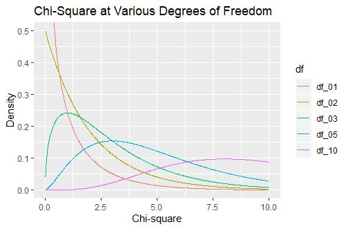

# 数理统计

> 书写本文是因为笔者在工作生活中常需要用到统计方法，然而笔者的统计学并不是很好，总是会忘，因此花一个清明节的下午来写一些基础知识，以便以后再用时可以快速搞懂原理并实际应用。本文或许会有些废话，如果你不喜欢看废话可以不看，不过我想有废话可能比太精炼好理解些吧

> 观看本文，你需要高等数学的基础，与一部分工科概率论的知识。本文并不介绍针对具体的例子应该如何操作，只介绍背后的原理。遇到问题后，应该上网或者翻书查查解决方案。

数理统计是什么？简而言之，在生活中你会获得数据，然而你却不知道数据服从的分布，或者知道数据服从什么类型的分布，却不知道它是什么参数。
统计推断依托于数理统计，你需要从获得的数据中推断出一些信息，例如小灯泡的不合格率，亦或者是两个因素之间是否独立。
本文将简要介绍*参数估计*与*假设检验*两种统计推断。

首先我们要明确样本的概念，即一个随机变量，它服从于要研究的总体相同的分布。同时，这个样本的抽取不会影响总体。例如，用尺子测量一个物体的长度，大致服从于正态分布，每一次测量得到一个随机变量的观察值，同时你测量这个动作并不会影响下一次测量的结果。（这种不影响总体的，叫做简单随机抽样）
然后定义**统计量** ，即样本们的多元连续函数。

$$
g(X_1,X_2,X_3\cdots X_n)
$$

这个多元连续函数不应该有任何未知的参数，例如，当你不知道样本服从的正态分布的均值时，你不可以把总体的均值放进这个函数（或者我们说，均值的真值），例如

$$
X_1+\mu
$$

不能称为统计量，因为 $\mu$ 不是已知的。请注意，统计量是个映射。只有当其中的东西是观察值时，我们称为统计量的观察值。当然，统计量也是一种随机变量。我们给出统计学中常用的统计量（统计函数）

$$
\begin{aligned}
\bar{X} = \frac{1}{n}\sum_{i=1}^n X_i \\
S^2 = \frac{1}{n-1}\sum_{i=1}^n (X_i - \bar{X})^{2}\\
A_k = \frac{1}{n}\sum_{i=1}^{n} X_i^{k}\\
B_k = \frac{1}{n}\sum_{i=1}^{n} (X_i - \bar{X})^{k}
\end{aligned}
$$

分别称为，样本均值，样本方差，样本k阶矩，样本k阶中心矩。首先不看后两个，只看样本方差，其定义和平常的方差定义十分不同，我们来探寻一下原因。

其中最重要的就是， 我们希望样本的统计量与真值越接近越好。为了更好的理解样本方差的定义，我们不得不首先描述一下大数定律和中心极限定理。

> 大数定律是指，当试验发生足够大次数时，事件A发生的频率依概率收敛到A的概率

## 中心极限定理

这是在说，对于任意的分布，其统计量 $\sum_{1}^{n}X_i$ 在n越大时，越近似于正态分布 $N(n\mu,n\sigma^{2})$，这是在说，尽管我完全不知道X的分布是什么，但是其加和最后都会近似于一个高斯分布。这是个非常牛逼的定理，通过这个定律我们可以得到

$$
\begin{aligned}
\mathrm{E}(\sum_{1}^{n}X_i) = n\mu =\mathrm{E}(n\bar{X})\\
\operatorname{Var}(\sum_{1}^{n}X_i) = \operatorname{Var}(n \bar{X}) = n\sigma^{2}\\
\mathrm{E}(\bar{X}) = \mu \\
\operatorname{Var}(\bar{X}) = \frac{\sigma^{2}}{n}  = \mathrm{E}(\bar{X}^{2})-(E(\bar{X}))^{2}
\end{aligned}
$$

我们看到，样本均值的方差随着n增大最后一定会收敛到0，也就是说，样本均值尽管在真值附近晃荡，但最后一定收敛到真值。

## 样本方差

基于同样的思想，我们也希望样本方差在真值附近晃荡，这意味着样本方差的期望是真值，同时样本方差的方差最后要趋于0，我们看看正常定义的方差V能不能做到这一点。

$$
\begin{aligned}
V^{2} &= \frac{1}{n}\sum_{i=1}^n (X_i - \bar{X})^{2}\\
\mathrm{E}(V^{2}) &= \frac{1}{n}\mathrm{E}(\sum_{1}^n (X_i^2-2X_i \bar{X}+\bar{X}^{2}))\\ 
&=\frac{1}{n}(\mathrm{E}(\sum_{i}X_i^{2})-n\mathrm{E}(\bar{X}^{2}))\\
&=\frac{1}{n}(\sum_{i}\mathrm{E}(X_i^{2})-n\mathrm{E}(\bar{X}^{2}))\\
&=\frac{1}{n}(\sum_{i}(\mu^2+\sigma^{2})-n(\frac{\sigma^{2}}{n}+\mu^{2}))\\
&=\frac{1}{n}(n-1)\sigma^{2}
\end{aligned}
$$

我们看到，确实做不到这一点，究其原因，是有限次抽样时，抽不到最两边的数，因此方差就会比真值小。当然，我们看到当n趋近于无穷时它就是真值，这称作渐进收敛。

但是样本方差就能做到这一点，我们就不进行证明了。（在理解上述推导时，请一定明确，什么是随机变量，什么是样本，什么是统计函数，例如Xbar，就是统计量，而不是一个观察值）

## 常用的分布

为了介绍参数估计和假设检验，我们还得明确常用的统计量的分布。例如我们看到样本均值这个统计量的分布就是接近正态分布的。
如果研究的总体是服从正态的，那么其特殊统计量的分布也是具有好性质的。

## $\chi^{2}$ 分布

设标准正态总体，即从中抽的每个样都是标准正态分布，则统计量

$$
\chi^{2} = X_1^{2}+X_2^{2}+\cdots X_n^{2}
$$

服从自由度为n的 $\chi^{2}$ 分布

这个图的意思就是在说当自由度为几的时候，卡方这个统计量的观察值落到某个地方的概率。例如，在自由度为1时，卡方的观察值落入0附近的概率最大，而自由度为3时，落入1附近概率最大

接下来我们立刻应用到实践中，看看，卡方检验

## $\chi^{2}$ chi方检验（卡方检验）

假设检验的基本思想是，尽管抽样具有随机性，但仍然应该落在某一范围，如果超出这个范围，就超出了随机误差解释的范围。卡方检验，就是利用卡方作为检验用的统计量。而卡方分布是可以查表的，我们可以轻易的查出，什么值落入了左右两边面积只有5%的区域，假设检验的原理就是，一次实验不会出这么小概率的事情，因此拒绝原假设

正态总体的情况下，如果只知道方差，则统计量

$$
\frac{(n-1)S^{2}}{\sigma^{2}}\sim \chi^{2}(n-1)
$$

这是因为统计量

$$
\frac{(n-1)S^{2}}{\sigma^{2}} = \sum_{i}(\frac{X_i - \bar{X}}{\sigma})^{2}
$$

其中，每个都可以看作一个标准正态分布，而且其自由度为n-1，因为这些新变量的和为0。
日常中使用的Pearson卡方检验的统计量是

$$
\sum_{i}\frac{(X_i-E_i)^{2}}{E_i}
$$

该统计量的极限分布是卡方分布。其中，E是理论频数，也就是根据给定的概率，这一随机变量的理论值是多少，一般用在独立性检验中，即在假设两个因素独立的情况下，实验值与理论值的差值是否过大。

该方法实际上应用于分布拟合检验，无需知道方差和均值。所谓分布拟合检验，就是看抽样得到的数据是不是服从某一个分布。而其背后，其实就是看在某一类中，它的观察数与这一类的理论值的偏差有多少。根据这个偏差构造出Pearson卡方统计量，如果这个偏差太大，就认为不符合某一概率分布，事实上，独立性也是一种概率分布。

| 处理 | 发癌数 | 未发癌数 | 合计 | 发癌率% |
| ---- | ------ | -------- | ---- | ------- |
| 甲组 | 52     | 19       | 71   | 73.24   |
| 乙组 | 39     | 3        | 42   | 92.86   |
| 合计 | 91     | 22       | 113  | 80.33   |

例如，我们考虑甲乙组处理和是否发癌之间是否独立。如果假设它们独立，那么落入甲组发癌的概率应该等于落入甲组的概率乘以发癌的概率，则理论频数就是这个概率再乘以总数。

$$
\begin{aligned}
P(A,cancer) = P(A)\cdot P(cancer) \\
P(A) = \frac{71}{113}\\
P(cancer) = \frac{91}{113}\\
E_{A,cancer} = P(A,cancer)\cdot 113=\frac{71\times 91}{113}
\end{aligned}
$$

每个格子都这么操作一遍得到E，再用Pearson卡方的定义求和，得到卡方统计量的观察值，最后查自由度=1的表就可以，如果大于给定的显著性水平的值，那就认为不独立。

让我们看看这个卡方是怎么导出来的。假设表格只有一行

| 处理 | 发癌数 | 未发癌数 | 合计 |
| ---- | ------ | -------- | ---- |
| 甲组 | O1     | O2       | n    |

预期结果O1服从一个B(n，p)的二项分布，而当n很大时，二项分布近似于一个正态分布（中心极限定理）
而预期左侧格的值为np，因此可以写出Pearson卡方统计量

$$
\begin{aligned}
\chi^{2} &= \frac{(O_1 - np)^{2}}{np}+\frac{(n-O_1-n(1-p))^{2}}{n(1-p)}\\
&= (\frac{O_1-np}{\sqrt{np(1-p)}})^{2}=(\frac{O_1-\mu}{\sigma})^{2}
\end{aligned}
$$

由于n越大，O_1就越类似正态分布，因此这个统计量就近似于标准正态分布的平方，同时也就是精确的卡方统计量的定义。

我们当然可以对其应用到更多行的表中，只不过需要更多的近似。

| 处理 | 发癌数      | 未发癌数   | 合计 |
| ---- | ----------- | ---------- | ---- |
| 甲组 | O1 (np1p3) | O2(np2p3) | np3  |
| 乙组 | O3 (np1p4) | O4(np2p4) | np4  |
| 合计 | np1         | np2        | n    |

写出其Pearson卡方统计量

$$
\begin{aligned}
\chi^{2}_1&=\frac{(O_1-np_1p_3)^{2}}{np_1p_3}+\frac{(O_2-np_2p_3)^{2}}{np_2p_3} \\
&= \frac{1}{p_3}(\frac{(O_1-np_1p_3)^{2}}{np_1}+\frac{(np_3-O_1-np_3(1-p_1))^{2}}{n(1-p_1)})\\
&= \frac{1}{p_3}(\frac{O_1-np_1p_3}{\sqrt{np_1(1-p_1)}})^{2}\\
\chi^{2}&=\chi _1^{2}+\chi _2^{2} = \frac{1}{p_3}(\frac{O_1-np_1p_3}{\sqrt{np_1(1-p_1)}})^{2} + \frac{1}{p_4}(\frac{O_3-np_2p_4}{\sqrt{np_2(1-p_2)}})^{2}
\end{aligned}
$$

我们注意到，当n非常大时

$$
(\frac{O_1-np_1p_3}{\sqrt{np_1p_3(1-p_1)}})^{2}\thickapprox (\frac{O_1-np_1p_3}{\sqrt{np_1p_3(1-p_1p_3)}})^{2}
$$

因此我们说Pearson卡方统计量可以近似卡方统计量。一个合计可以减掉一个自由度，是因为在计算统计量的时候使用了合计的信息，因此总自由度等于(行-1)乘以(列-1)等于1

$$F = (r-1)(c-1)$$

## t分布

设标准正态总体，则统计量

$$
T = \frac{X_0}{\sqrt{\frac{\sum_{i=1}X_i^{2}}{n}}}
$$

服从自由度为n的t分布。当n趋近于无穷时，t分布收敛到正态分布。统计量T，实际上是抽取了n+1个试验的观察值。

## t检验

我们仍然需要快速的说一下t检验，因为笔者急需使用。这里给出正态总体的另一些性质

$$
\begin{aligned}
\frac{\bar{X}-\mu}{\frac{\sigma}{\sqrt{n}}} \sim N(0,1) \\
\frac{\bar{X}-\mu}{\frac{S}{\sqrt{n}}} \sim t(n-1)
\end{aligned}
$$

第一个就是在做正态分布的标准化而已，而第二个由卡方分布的相关性质也容易证明。
于是我们看到，t分布的使用就是为了纠正因为样本方差带来的损失。t检验可以给出只知道均值（假设均值）的情况下的检验。
常用到的是成对数据的t检验，比如看一个药在n个病人身上能否起到降血糖的作用。这可以通过做差获得吃药前后的血糖变化差值，将这个统计量看作服从正态总体，随后按正态总体统计量计算观察值，与t分布做对比即可

$$
t = \frac{\bar{X}-\mu}{\frac{S}{\sqrt{n}}}
$$

总而言之，做假设检验时，需要注意的是选取什么样的统计量，统计量一定要是所有参数已知的，包括要检验的量，这是因为假设检验就是先假设要检验的量是什么值后，给出统计量的分布，然后看实验值和理论值符合不符合。

## F分布

设正态总体，则统计量

$$
F = \frac{\frac{X_1^{2}+X_2^{2}+\cdots +X_{n_1}^{2}}{n_1}}{\frac{Y_1^{2}+Y_2^{2}+\cdots +Y_{n_2}^{2}}{n_2}}
$$

服从自由度为n_1，n_2的F分布

# 参数估计

有些问题，它们的分布是清楚的，但分布具体使用什么参数我们不知道，因此要估计参数。
参数怎么估计呢？肯定不可能是凭空而来的，而是通过既有的测量得到的，因此事实上我们使用特殊的统计量来估计参数，例如，我们可以通过样本均值这个统计量估计总体均值。
还有一点需要说明，如果参数不确定，那么参数就可能有一个取值范围，那么分布函数就不能简单的写为 $F(x)$ ，而要写成 $F(x,\theta)$ ，这表示分布函数不光与随机变量的取值有关，还跟参数的选定有关。
以下内容，某个能够估计参数真值的统计量称为估计量，记为 $\hat{\theta}$，而真值则不带hat。

## 矩估计法

我们知道，当样本容量越大，则样本r阶矩收敛于总体r阶矩。也就是说，在样本容量较大时，我们可以用样本r阶矩，替换总体r阶矩。
即，总体r阶矩是有公式可以算的，且就跟分布的参数有关，跟抽样结果无关。样本r阶矩也是可以算的，跟参数无关，只跟抽样结果有关，二者联立，解方程组就可以把参数解出来。
例如，某一分布，分布函数长成 $F(x,\theta_1,\theta_2,\theta_3\cdots \theta_k)$
那我们就需要求它的k个矩，因为有k个参数。

$$
\begin{aligned}
E(X) &= g_1(\vec{\theta}) \\
E(X^{2})&= g_2(\vec{\theta})\\
\cdots\\
E(X^{k}) &=g_k(\vec{\theta})
\end{aligned}
$$

在上面的式子中，左侧的只是个表示符号，不知道确切的值，右边的是表示方法，也不知道确切的值。为了解出theta，必须得给个值，它们就是样本r阶矩。

$$
\begin{aligned}
g_1(\vec{\theta}) &= \frac{1}{n}\sum_{i}X_i \\
g_2(\vec{\theta}) &= \frac{1}{n}\sum_{i}X_i^{2}\\
\cdots \\
g_k(\vec{\theta}) &= \frac{1}{n}\sum_{i}X_i^{k}
\end{aligned}
$$

右边的值可以确切的算出来，因此可以把theta解出来，并且解有如下的形式

$$
\hat{\theta_j} = h_j(X_1,X_2\cdots X_n)
$$

我们看到，解也是个统计量，因此可以把它当作估计量。以上内容可以简写成

$$
\begin{aligned}
f(\theta) &= x \\
\hat{\theta}&=f^{-1}(x)\\
f:\mathbb{R}^{n}&\to \mathbb{R}^{n}
\end{aligned}
$$

举个例子，我知道一个试验服从二项分布，但是不知道它是多少次两点分布叠加的二项分布，也不知道概率是多少，即B(m,p)的m和p都未知，这是一个参数估计的问题。现在，我们做了n从试验，每次试验的结果都是服从二项分布的一个结果（给定了二项分布后，依据概率从中提取了n个值），根据抽样结果估计m和p。首先算矩。

$$
\begin{aligned}
\mathrm{E}(X) &= mp \\
\mathrm{E}(X^{2})&= \operatorname{Var}(X)+(\mathrm{E}(X))^{2} \\&= mp(1-p)+(mp)^{2}
\end{aligned}
$$

接着用样本矩代替理论矩

$$
\begin{aligned}
mp &= \frac{1}{n}\sum_{i}X_i \\
mp(1-p)+(mp)^{2} &=\frac{1}{n}\sum_{i}X_i^{2}
\end{aligned}
$$

最后求解即可。

## 极大似然估计

极大似然估计的原理非常简单，即我们认为我们做的一系列结果，应该是给定参数下概率最大的事件。也就是说，如果给出一些估计的参数，试验结果并不是概率最大的事件，那么这个参数就应该调整。
举个例子，我知道一个试验服从高斯分布，现在我随机抽取1个结果，恰好为0，那么我们就猜测这个高斯分布的均值为0，因为这就是使当下发生的事件概率最大的参数选择，选择其它的参数都会使发生当前事件的概率变小，而发生另一事件的概率变大。极大似然估计的原理就是认为当下发生的事情就是发生概率最大的那个。
当然，这只是一种人们的经验罢了，可以根据最小二乘互推，回归算法不光最小二乘，因此估计也不一定要极大似然，不过这确实有效。
因此我们定义似然函数

$$
L(\theta) = \prod_{i=1}^{n} p(x_i,\theta)
$$

其中xi是观察值，是给定的。那么我们要求的，就是求使得似然函数最大的theta。最直观的感觉是啥呢？求导，不错，求导数为0的点就是极值点。不过连乘的求导是麻烦的，我们对其取对数。

$$
\frac{\partial \ln L(\theta)}{\partial \theta_i} = 0
$$

满足这个似然方程的称为最大似然估计量。
例如某个总体的概率为

$$
\begin{aligned}
p(1) &= \theta^{2} \\
p(2) &= 2\theta(1-\theta)\\
p(3) &= (1-\theta)^{2}
\end{aligned}
$$

现在观察到2个1和1个2

似然函数为

$$
L(\theta) = \theta^{4}\cdot 2\theta(1-\theta)
$$

那么其极大似然函数的对数是

$$
\begin{aligned}
\ln L(\theta) &= \ln 2+5\ln \theta+\ln (1-\theta) \\
\hat{\theta} &= \frac{5}{6}
\end{aligned}
$$

极大似然估计需要比矩估计的更多信息，然而它也比矩估计更优良。

至于评价估计量的优良性，我们暂时不提，只说一个，之前提到的样本方差其实就是总体方差的无偏估计量，而我们想用的那个方差是个渐进无偏估计量

## 区间估计

以上的估计只能给出一个点的估计量，因此也称为点估计，然而点估计量只是真值的近似，并不真的是真值，因此人们希望获得一个包含了真值的区间。这就是区间估计。
设 $A_1,A_2$ 是两个统计量(也可以理解为两个随机变量)，若

$$
P(A_1< \theta < A_2) = 1-\alpha
$$

则称A1，A2是theta 的置信水平为1-alpha的置信区间。
它的含义是，每组实验做完后，都可以得到一组置信区间，然而其中包含真值的组数只有(1-alpha)
一般来说，这个区间是由一个点估计量±一个误差项得到的。比如说一个正态总体已知方差求均值，尽管我们不知道μ到底是多少，但我们能确定一件事，那就是

$$
\frac{\bar{X}-\mu}{\frac{\sigma}{n}}\sim N(0,1)
$$

用样本均值处理了一下之后可以获得一个标准正态的随机变量。那当 $P(\bar{X}-\mu \ge 0) =  0.5$ 是不是同样意味着，真值μ<=样本均值统计量的概率为50%？
可以理解为，置信区间完全是自己构造的，然而人们有一些常用的置信区间，它们更短。
例如我们想要构造来自正态总体的置信区间，如果已知方差，我们惊讶的发现

$$P(\left\vert \frac{\bar{X}-\mu}{\frac{\sigma}{n}} \right\vert < z_{\frac{\alpha}{2}}) = 1-\alpha$$

我们就得到了均值的区间估计。
所以区间估计到底在说什么，就是说，通过一通变换，把实验值和待估计的值联合了起来，形成一个新的随机变量，它有一个我们已知的分布。于是在理论上，我们把实验值和待估计的值联合起来的新值落入某个区间的概率为0.95的那个区间求出来。问题是由于我们已经做了实验所以实验值是已知的，但是概率仍然不会错，因此真值就有了活动的空间。
我们再举个例子。
已知正态总体N(mu,sigma^2)，但不知道真值μ，估计sigma。构造的起点是样本方差，因为它是sigma的无偏估计

$$
\frac{(n-1)S^{2}}{\sigma^{2}}\sim \chi^{2}(n-1)
$$

因此需要求出对于哪个区间这个新的随机变量落入其中的概率为0.95

$$
P(\chi^{2}_{1-\frac{\alpha}{2}}<\frac{(n-1)S^{2}}{\sigma^{2}}<\chi^{2}_{\frac{\alpha}{2}}) = 1-\alpha = 0.95
$$

由于样本方差已定，因此真值有了活动的空间

$$
\frac{(n-1)S^{2}}{\chi^{2}_{\frac{\alpha}{2}}}<\sigma^{2}<\frac{(n-1)S^{2}}{\chi^{2}_{1-\frac{\alpha}{2}}}
$$

# 假设检验

假设检验，其本质思想非常简单，首先我们假设一个事情具有某个特定的分布，然后我们用概率学的方法，随机抽取随机变量，经过各种运算得到新的随机变量，新的随机变量会有一个既定的分布函数。然后我们进行测量，测n次，就跟抽取随机变量似的，然后我们对抽取的观察值进行同样的运算，得到统计量的观察值。对比其对应的随机变量的分布函数看看这个统计量的观察值应不应该出现。一般来说，我们认为一次试验不应该出现只有5%的结果。所以，如果统计量的观察值恰好是小概率事件，我们不认为它真的小，而是我们的假设错了，故拒绝原假设
用书上的话说，如果在零假设的条件下，某个事件发生的概率很小，我们认为它在一次试验中不会发生，然而在一次观察中该事件“居然”发生了，根据反证法，我们认为零假设错误，即拒绝零假设。

因此进行假设检验的方法就从上述原理中得到。首先我们应该有个假设，然后我们认为这个假设为真，在这个前提下，我们找一找（构造）有什么发生概率很小的事件（找到这个事件也是有技巧的，不过按照前人的经验基本上没问题，除非你想发数学创新论文），然后我们进行实验，看看这个发生概率很小的事件发生了没有，如果没有发生，那我们就没有理由拒绝原假设，当然，你可以找更多概率很小的事情来进行检验，不过已经有了一套非常好的经验。

例如，从正态总体已知方差，对均值进行假设检验。假设均值为0。那么在这个假设下的小概率事件就是

$$
P(\left\vert  \frac{\bar{X}-0}{\frac{\sigma}{n}}\right\vert >z_{\frac{\alpha}{2}}) = 0.05
$$

然后我们做实验，检验一下，以下语句是否为真

$$
\left\vert  \frac{\bar{x}-0}{\frac{\sigma}{n}}\right\vert >z_{\frac{\alpha}{2}}
$$

x是观察值。

卡方检验和t检验已在前面叙述过。
卡方检验适用于独立性检验（实际上用的是Pearson卡方统计量），选择的发生概率很小的事件是

$$
P(\sum_{i}\frac{(X_i-E_i)^{2}}{E_i}>\chi^{2}_{\alpha}) = 0.05
$$

t检验适用于显著性检验，主要对比的是有关系的两组数据，实际上是对一组差值，它们服从方差未知的正态分布。选择的发生概率很小的事件是

$$
P(\left\vert \frac{\bar{d}-\mu}{\frac{S}{\sqrt{n}}} \right\vert >t_{\alpha} ) = 0.05
$$

对于任意的双正态总体，例如两个正态总体的方差比对，一般是使用F检验
